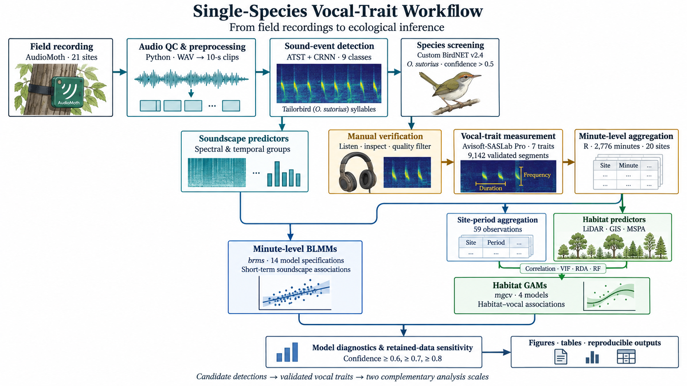

# Single-Species Vocal Trait Workflow

An illustrated learning package for moving from passive acoustic recordings to ecological models of one focal species.

<p align="center">
  
</p>

This repository follows the Common Tailorbird (*Orthotomus sutorius*) case study from Shenzhen. It connects field recording, sound-event detection, species screening, manual review, vocal-trait measurement, data aggregation, BLMMs, GAMs, and sensitivity checks.

**[中文指南](README.zh-CN.md) · [Start the lessons](docs/00-orientation.md) · [Run the analysis](analysis/README.md) · [See the roadmap](TODO.md)**

## What You Will Learn

- how one recording becomes a traceable ecological observation;
- where machine screening ends and human validation begins;
- how seven vocal traits are aggregated from segments to minutes;
- why BLMMs and GAMs answer different ecological questions;
- how model checks and confidence sensitivity support interpretation.

## Start Here

```bash
git clone https://github.com/Fly-Carrot/single-species-vocal-trait-workflow.git
cd single-species-vocal-trait-workflow
python3 scripts/01_audio_manifest.py --input data/demo --output outputs/audio_manifest.csv
python3 scripts/02_segment_audio.py --input data/demo/common-tailorbird-denoised.wav --output outputs/clips --seconds 2
```

To rebuild the teaching figures:

```bash
python3 -m pip install -r requirements.txt
python3 scripts/make_demo_figures.py
```

To inspect the public analysis tables:

```bash
python3 analysis/download_public_data.py
Rscript analysis/01_data_check.R
```

Long model fits are optional. Set `RUN_MODELS=true` before running the BLMM or GAM scripts.

## Workflow at a Glance

| Stage | Main tool | Output |
| --- | --- | --- |
| Field recording | AudioMoth | WAV files and site metadata |
| Audio preparation | Python | file manifest and 10-s clips |
| Sound-event detection | ATST + CRNN | nine event classes |
| Species screening | custom BirdNET v2.4 | focal-species candidates |
| Manual verification | listening + spectrogram review | validated vocal segments |
| Vocal-trait measurement | Avisoft-SASLab Pro | seven vocal traits |
| Minute-level analysis | R + `brms` | 14 BLMM specifications |
| Habitat analysis | R + `mgcv` | four response-specific GAMs |
| Robustness checks | R | diagnostics and confidence sensitivity |

## Learning Paths

**Quick tour, 30–60 minutes**  
Read the orientation, inspect the example waveform and spectrogram, build an audio manifest, and segment the sample WAV.

**Core practical, one day**  
Follow the validation and vocal-trait lessons, download the public tables, inspect the 2,776 minute records, and review the model formulas.

**Full analysis, several days**  
Run the spatiotemporal tests, 14 BLMMs, four GAMs, and the retained-data sensitivity summaries.

## Repository Map

```text
assets/      workflow and audio figures
data/        one teaching WAV and reusable templates
docs/        short lessons for each workflow stage
scripts/     audio manifest, segmentation, and figure tools
analysis/    public-data download and R analysis scripts
TODO.md      planned additions and required materials
```

## Case-Study Numbers

The full PAM network contained 21 sites. The focal-species trait analysis used 20 sites, 9,142 validated vocal segments, 2,776 minute-level observations, and 59 site-period observations. The statistical workflow contains 14 minute-level BLMM specifications and four habitat GAMs.

## Companion Data

The manuscript-aligned public tables are maintained in [Fly-Carrot/Raw-Data-01](https://github.com/Fly-Carrot/Raw-Data-01). The download script fetches a small analysis-ready subset from that repository.

## Use and Citation

The code is released under the MIT License. The demo audio is a project-provided teaching sample from the companion data repository. Please cite the associated article and the archived repository release when they become available.
