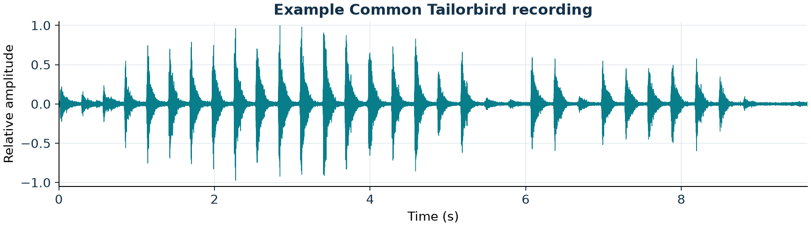
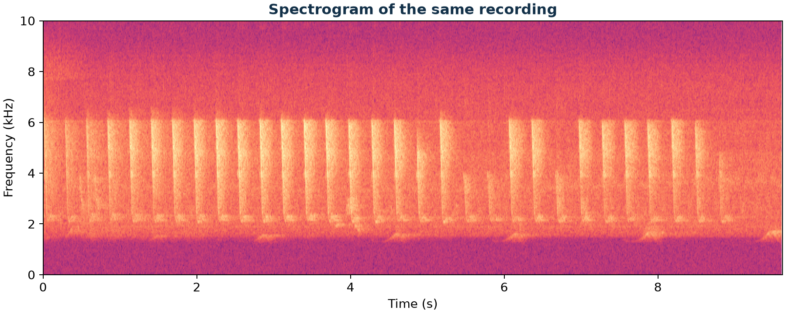
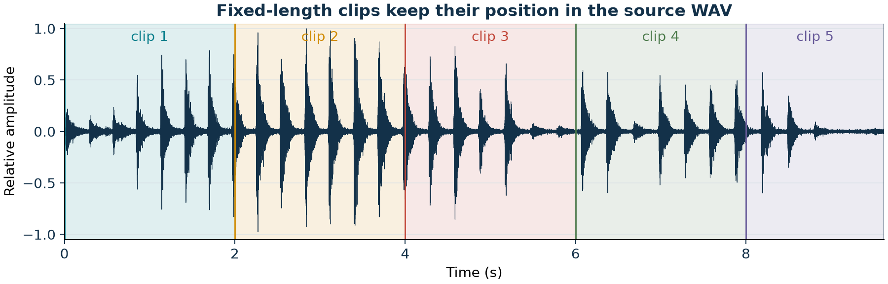

# 2. Audio Preparation

## Goal

Build a file manifest, check the WAV files, and make model-ready clips.

## Build the Manifest

```bash
python3 scripts/01_audio_manifest.py \
  --input data/demo \
  --output outputs/audio_manifest.csv
```

The script records the file name, duration, channels, sample rate, sample width, and file size. It also assigns a stable SHA-256 hash.

## Make Short Clips

The study pipeline divided each 1-minute recording into six 10-second clips. The included sample is 9.6 seconds long, so the command below uses 2-second clips for a clearer exercise.

```bash
python3 scripts/02_segment_audio.py \
  --input data/demo/common-tailorbird-denoised.wav \
  --output outputs/clips \
  --seconds 2
```

Every clip receives a manifest row with its source file, clip number, start time, end time, and output path.

## Inspect the Same Audio Three Ways







## Checks

- The clips cover the source file in order.
- No clip overlaps another clip.
- The final clip may be shorter than the requested length.
- Audio format and sample rate remain unchanged.
- The clip manifest links every output to its source file.

These short clips support model screening. After a focal-species candidate has been verified, follow the separate [Audition lesson](09-audition-audio-preparation.md) to prepare it for vocal-trait measurement.
