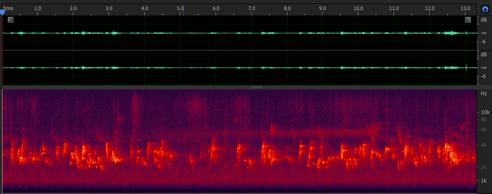
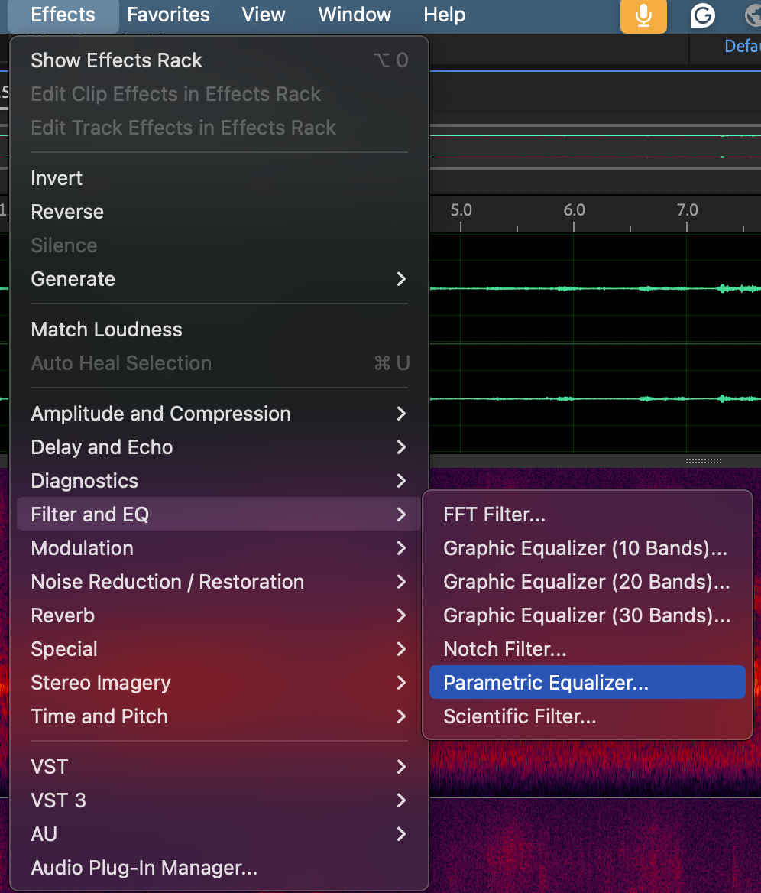
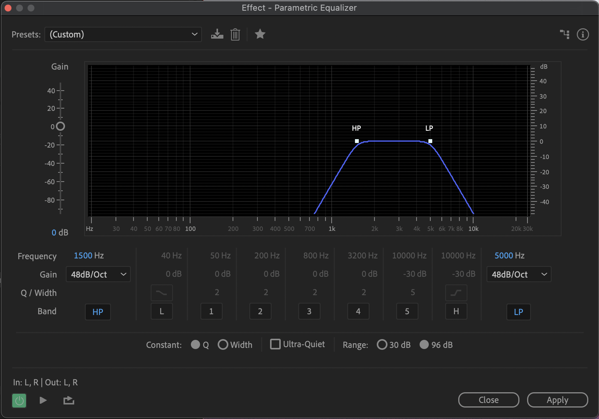
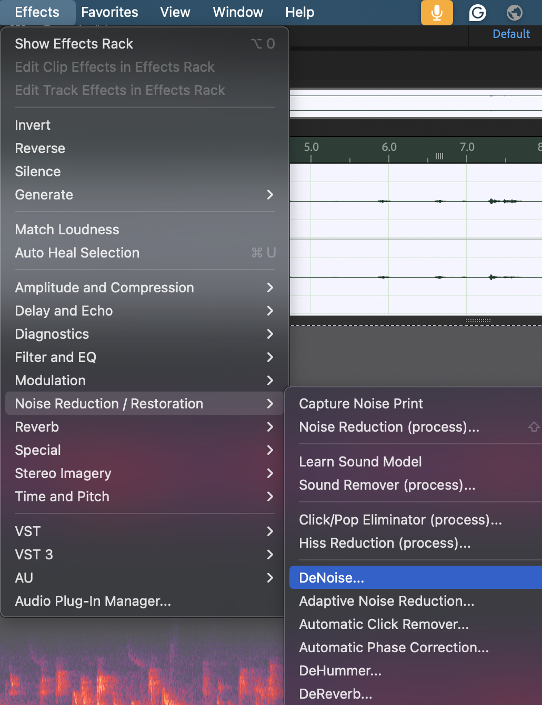
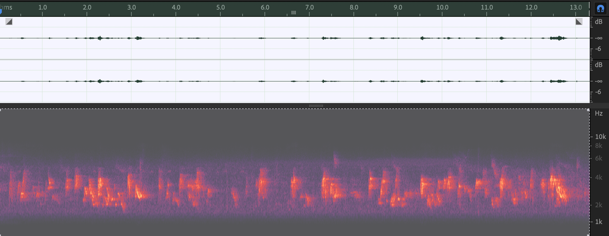

# 9. Preparing Vocal Clips in Adobe Audition

Use this lesson after [species screening](04-species-screening.md) and [manual verification](05-manual-verification.md). The input is a focal-species candidate that has been checked by listening and spectrogram inspection. The output is a traceable WAV for [Avisoft measurement](10-avisoft-vocal-trait-measurement.md).

These screenshots come from slides 62-65 of the project team's Kingfisher Forum workshop. They show one teaching example.

## 1. Inspect the Candidate

Open a working copy of the clip. Keep the source WAV unchanged. Listen while checking the waveform and spectrogram for the focal syllables, overlap, clipping, and weak signal.

Record the source filename, candidate time range, and review decision before editing. The [validation template](../data/templates/manual-validation-template.csv) provides a place for these decisions.

## 2. Inspect the Frequency Band

The workshop opens **Effects > Filter and EQ > Parametric Equalizer**.

Its example uses a 1,500 Hz high-pass filter and a 5,000 Hz low-pass filter around a clearly visible vocal band. The screenshot also shows 48 dB/oct slopes. Treat these as the values of this example, and check the full signal before choosing settings for another clip.

Filtering can change measured frequency limits. Keep a copy of the original recording and record which version enters the trait-measurement step.

## 3. Review Noise Treatment

The next workshop screen selects **Effects > Noise Reduction / Restoration > DeNoise**.

Listen again after processing. Check that the target syllables remain intact and that the spectrogram does not show obvious processing artefacts. Keep the chosen DeNoise settings with the clip record.

The two spectrogram screenshots support a visual check. They are not a numerical test of noise reduction or measurement accuracy.

## 4. Export for Measurement

Save the prepared clip as WAV. Keep the source identifier and time range in its filename or companion manifest. Record the sample rate, channels, bit depth, filters, and DeNoise settings used. Reopen the exported WAV and check the vocal boundaries before moving to Avisoft.

## Classroom Check

For one candidate, a student should be able to show the original and prepared WAV, point to the same vocal units in both spectrograms, and explain the review decision. The project-specific export settings and frequency-measurement treatment will be added to this lesson when the corresponding preset or processing record is available.
