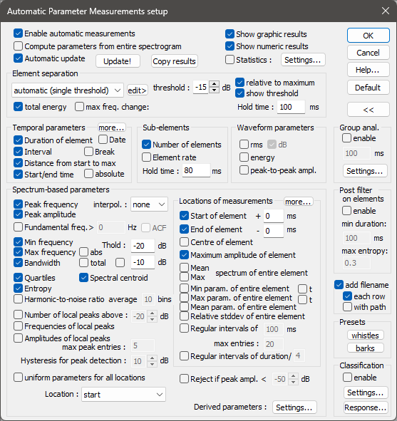
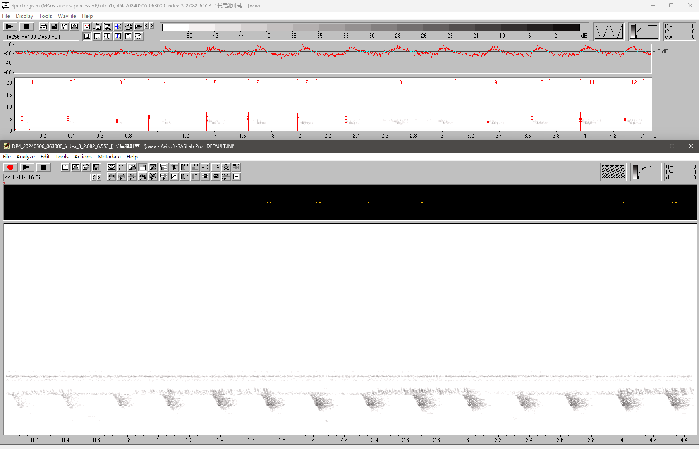

# 10. Measuring Vocal Traits in Avisoft-SASLab Pro

Begin with a validated WAV from the [Audition lesson](09-audition-audio-preparation.md). The workshop screenshots show the measurement controls, automatically marked elements, and the exported column names.

## 1. Set Up the Measurement

Open the clip in Avisoft-SASLab Pro. Inspect the time and frequency axes before detecting elements. The workshop's **Automatic Parameter Measurements** screen shows element separation, a threshold relative to the clip maximum, temporal parameters, and spectrum-based parameters.

In this example screenshot, the element threshold is **-15 dB relative to maximum** and the hold time is **100 ms**. These values identify the pictured setup. Record the settings used for each teaching exercise with its output.

## 2. Mark and Review Syllables

The workshop then shows Avisoft marking high-energy regions as numbered elements. Listen to the clip and review each marked boundary. Correct merged syllables, fragments, and background events before exporting measurements.

The screenshot illustrates the interface and numbering. Element boundaries still need a vocal-unit check before they enter the validated dataset.

## 3. Export the Measurements

Workshop slide 67 shows an output table with `Number`, `Duration`, `Interval`, `starttime`, `endtime`, `elements`, `peakfreq`, `minfreq`, `maxfreq`, `bandw`, `centroid`, and `filename`, among other columns. Keep the filename and source time range when exporting.

| Analysis trait | Output used in the lesson | Unit or calculation |
| --- | --- | --- |
| syllable count | validated element rows within the analysis minute | count |
| inter-syllable interval | `Interval` | seconds in the pictured export; confirm in the saved project settings |
| minimum frequency | `minfreq` | Hz |
| maximum frequency | `maxfreq` | Hz |
| peak frequency | `peakfreq` | Hz |
| centroid frequency | `centroid` | Hz |
| bandwidth | `bandw` | Hz; compare with `maxfreq - minfreq` |

The table in slide 67 contains example rows from several files. The image is not a reference answer for the student exercise. The seven project traits are summarized in [the vocal-trait lesson](06-vocal-traits.md), and the validated segments are combined at the minute level in [the aggregation lesson](07-aggregation.md).

## Classroom Check

Export one short, reviewed clip. Count its accepted syllables, confirm the source ID in every row, and check the units and frequency columns. A project reference export and the saved Avisoft settings will provide exact expected values for a scored exercise.
